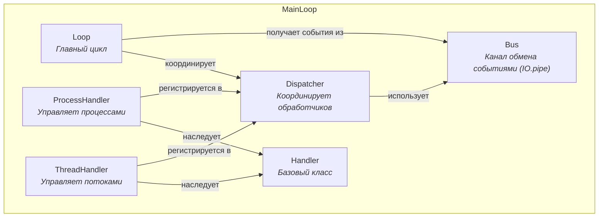
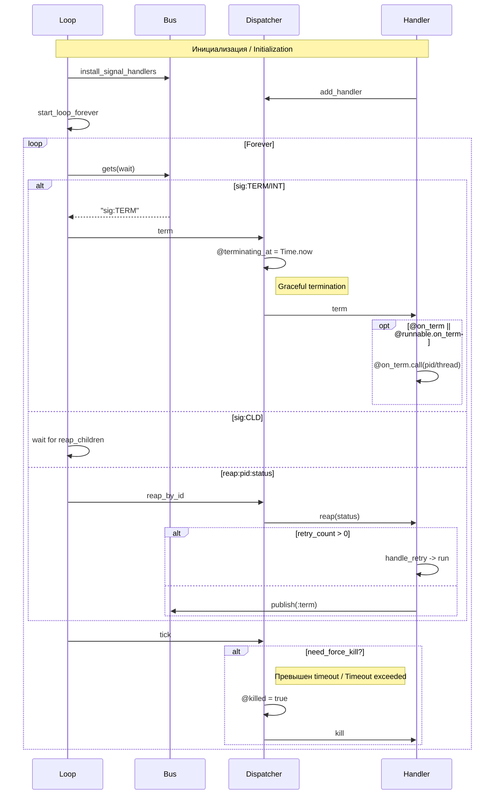

# MainLoop

<div align="center">

[](https://rubygems.org/gems/main_loop)
[](https://rubygems.org/gems/main_loop/versions)
[](http://www.rubydoc.info/gems/main_loop)

[](https://lysander.rnds.pro/api/v1/badges/main_loop_coverage.html)
[](https://lysander.rnds.pro/api/v1/badges/main_loop_quality.html)
[](https://lysander.rnds.pro/api/v1/badges/main_loop_outdated.html)
[](https://lysander.rnds.pro/api/v1/badges/main_loop_vulnerable.html)

</div>

**MainLoop** — Ruby-библиотека для управления субпроцессами и потоками с функциями:
- автоматический сбор дочерних процессов (reaping)
- корректное завершение (SIGTERM/SIGINT) процессов и потоков
- автоматический перезапуск по количеству повторов
- принудительное завершение по таймауту
- обработка завершения процессов и потоков

---

**MainLoop** is a Ruby library for managing subprocesses and threads with features:
- automatic child process reaping
- graceful shutdown (SIGTERM/SIGINT) for processes and threads
- automatic restart by retry count
- timeout-based force termination
- process/thread completion handling

<div align="left">
  <a href="https://rnds.pro/" >
    
  </a>
</div>

## Возможности / Features

- Потоко-безопасный канал обмена событиями (IO.pipe) / Thread-safe event bus (IO.pipe)
- Управление процессами через Kernel.fork / Process management via Kernel.fork
- Управление потоками через Thread.new / Thread management via Thread.new
- Обработка сигналов TERM/INT/CLD / SIGTERM/INT/CLD signal handling
- Автоматический сбор завершенных процессов / Automatic child process reaping
- Retry-логика для перезапуска / Retry logic for restarts
- Принудительное завершение по таймауту / Timeout-based force termination

## Начало работы / Getting started

> gem install main_loop

При установке `MainLoop` через bundler добавьте следующую строку в `Gemfile`:

---

If you'd rather install `MainLoop` using bundler, add a line for it in your `Gemfile`:

> gem 'main_loop'

Затем выполните / Then run:

> bundle install # для установки гема / gem installation

## Корневой модуль / Root module

`MainLoop` - это корневой модуль, который подключает все компоненты:

---

`MainLoop` is the root module that requires all components:

```ruby
require 'main_loop'
```

Субмодули / Submodules:

- `MainLoop::Bus` — канал обмена событиями (IO.pipe)
- `MainLoop::Dispatcher` — координация обработчиков и управление жизненным циклом
- `MainLoop::Loop` — главный цикл обработки событий и сигналов
- `MainLoop::Handler` — абстрактный базовый класс
- `MainLoop::ProcessHandler` — управление субпроцессами
- `MainLoop::ThreadHandler` — управление потоками

## Архитектура / Architecture



## Жизненный цикл обработчика / Handler lifecycle



## Способы определения логики

Библиотека поддерживает два основных подхода для описания работы процессов и потоков:

### 1. **Блок (inline block)**

Передайте блок кода непосредственно в конструктор обработчика (`ProcessHandler` или `ThreadHandler`). В этом блоке размещается основная логика. При завершении (по сигналу, ошибке или таймауту) блок прерывается; вы можете определить дополнительные действия, используя переданный объект обработчика.

```ruby
MainLoop::ProcessHandler.new(dispatcher, 'my_process', retry_count: 3) do
  # основная логика
  loop { sleep 1 }
end

MainLoop::ThreadHandler.new(dispatcher, 'my_thread', retry_count: 0) do |handler|
  handler.on_term do
    # действия при завершении (очистка, закрытие ресурсов)
    @stop = true
  end
  # основная логика с возможностью проверки флага
  @stop = false
  loop { sleep 1; break if @stop }
end
```

### 2. **Объект с интерфейсом run / on_term**

Передайте экземпляр класса, который реализует два обязательных метода:
- `run` — содержит основную логику; для `ProcessHandler` метод не принимает аргументов, для `ThreadHandler` получает объект потока.
- `on_term` — вызывается при необходимости завершить процесс/поток; для `ProcessHandler` принимает PID, для `ThreadHandler` — объект потока. В этом методе следует инициировать корректное завершение (например, послать сигнал процессу или установить флаг остановки для потока).

```ruby
class Worker
  def run
    trap('USR1') { @stop = true; raise Interrupt }
    @stop = false
    loop { sleep 1; break if @stop }
  rescue Interrupt
    # завершаемся
    exit 0
  end

  def on_term(pid)
    Process.kill('USR1', pid)
  end
end

MainLoop::ProcessHandler.new(dispatcher, 'worker', runnable: Worker.new)
```

Оба подхода могут комбинироваться с параметрами (`retry_count`, `logger` и т.д.) и одинаково хорошо интегрируются с циклом `MainLoop::Loop`.

Выбор зависит от удобства: для простых сценариев подойдёт блок, для сложной логики управления завершением — объект с явными методами.

## Использование / Usage

### Базовая настройка / Basic setup

```ruby
require 'main_loop'
require 'logger'

logger = Logger.new(STDOUT)
logger.level = Logger::DEBUG

# Шина и диспетчер. Параметр timeout (в секундах) опционален.
bus = MainLoop::Bus.new
dispatcher = MainLoop::Dispatcher.new(bus, timeout: 10, logger: logger)
mainloop = MainLoop::Loop.new(bus, dispatcher, logger: logger)
```

### Обработка процессов / Process handling

#### Простейший пример / Simplest example

```ruby
# Процесс test1: будет перезапущен 3 раза, после завершения выходит с кодом 0
MainLoop::ProcessHandler.new dispatcher, 'test1', retry_count: 3, logger: logger do
  sleep 2
  exit! 0
end

# Процесс test2: обрабатывает SIGTERM и выходит с кодом 1 после 2 перезапусков
MainLoop::ProcessHandler.new dispatcher, 'test2', retry_count: 2, logger: logger do
  trap 'TERM' do
    exit(0)
  end
  sleep 2
  exit! 1
end
```

#### С блоком кода / With code block

```ruby
MainLoop::ProcessHandler.new dispatcher, 'worker', retry_count: 3, logger: logger do
  loop do
    # основная логика / main logic
    sleep 1
  end
  exit 0
end
```

#### С объектом runnable / With runnable object

```ruby
class Worker
  def run
    # Используем пользовательский сигнал, чтобы прервать системные вызовы (например, sleep)
    trap('USR1') do
      puts "Получен USR1. pid = #{Process.pid}"
      @stop = true
      raise Interrupt   # прерывает текущий блок (sleep и т.д.)
    end

    @stop = false
    loop do
      puts "работаю..."
      sleep 100
      break if @stop
    rescue Interrupt
      puts "прерывание, выходим"
      break
    end
    exit 0
  end

  def on_term(pid)
    puts "Завершаю работу. pid = #{pid}"
    Process.kill('USR1', pid)   # посылаем пользовательский сигнал

    begin
      Timeout.timeout(5) { Process.wait(pid) }
    rescue Timeout::Error
      puts "не завершился за 5 секунд"
    end

    puts "Завершил работу"
  end
end

worker = Worker.new
MainLoop::ProcessHandler.new(dispatcher, 'worker', runnable: worker, retry_count: :unlimited, logger: logger)
```

### Обработка потоков / Thread handling

#### Поток с блоком / Thread with block

```ruby
# Поток thread2: не перезапускается (retry_count: 0), выполняет внешнюю команду
MainLoop::ThreadHandler.new dispatcher, 'thread2', retry_count: 0, logger: logger do
  system('sleep 15;echo ok')
end
```

#### Поток с блоком и колбэком завершения / Thread with block and termination callback

```ruby
MainLoop::ThreadHandler.new dispatcher, 'worker', retry_count: 0, logger: logger do |handler|
  # Устанавливаем обработчик завершения потока
  handler.on_term do
    puts "Завершаем поток, выполняем cleanup..."
    @stop = true
  end

  @stop = false
  loop do
    puts "Работаю..."
    sleep 1
    break if @stop
  end
end
```

#### Поток с объектом runnable / Thread with runnable object

```ruby
class Worker
  def run(thread)
    @stop = false
    loop do
      sleep 60
      break if @stop
    end
  end

  def on_term(thread)
    @stop = true
    thread&.wakeup
  end
end

worker = Worker.new
MainLoop::ThreadHandler.new dispatcher, 'worker', runnable: worker, logger: logger
```

### Запуск цикла / Start loop

```ruby
# Бесконечный цикл / Infinite loop
mainloop.run

# С таймаутом (30 секунд) / With timeout (30 seconds)
mainloop.run(30)
```

## Обработка завершения / Termination handling

Когда отправляется сигнал `TERM` или `INT`:

1. `trap` перехватывает сигнал и отправляет `bus.puts("sig:TERM")`
2. `Loop` получает событие из `Bus` и вызывает `Dispatcher#term`
3. `Dispatcher` устанавливает `@terminating_at = Time.now`
4. Все обработчики получают `term`:
   - `ProcessHandler` посылает `Process.kill('TERM', pid)`
   - `ThreadHandler` вызывает `@on_term` блок
5. Если через `timeout` (по умолчанию 5 сек) процессы не завершились:
   - `Dispatcher#tick` проверяет `need_force_kill?`
   - Если `true` — посылает `kill` всем обработчикам
6. Когда все обработчики завершаются (`finished?`):
   - `Dispatcher#try_exit!` вызывает `exit(@exit_code)`

---

When sending `TERM` or `INT` signal:

1. `trap` catches the signal and sends `bus.puts("sig:TERM")`
2. `Loop` gets the event from `Bus` and calls `Dispatcher#term`
3. `Dispatcher` sets `@terminating_at = Time.now`
4. All handlers receive `term`:
   - `ProcessHandler` sends `Process.kill('TERM', pid)`
   - `ThreadHandler` calls `@on_term` block
5. If processes don't terminate within `timeout` (default 5 seconds):
   - `Dispatcher#tick` checks `need_force_kill?`
   - If `true` — sends `kill` to all handlers
6. When all handlers finish (`finished?`):
   - `Dispatcher#try_exit!` calls `exit(@exit_code)`

## Повторы (retry) / Retry

```ruby
retry_count: 3      # повторить 3 раза / retry 3 times
retry_count: 0      # не повторять / don't retry
retry_count: :unlimited  # бесконечные повторы / infinite retries
```

## Публикация событий / Publishing events

Обработчики могут отправлять события в шину:

---

Handlers can publish events to the bus:

```ruby
# Из любого места обработчика / From any handler place:
publish("reap:#{id}:exited")
publish(:term)
```

## Особенности / Features

- **Потоко-безопасность**: `Bus` и `Dispatcher` используют `MonitorMixin`
- **Таймауты**: `Timeouter` используется для timeout в `Bus#gets` и `Loop#start_loop_forever`
- **Логирование**: все классы принимают параметр `logger:`, по умолчанию `Logger.new(nil)`
- **Ошибки**: используйте `rescue StandardError` (не пустой `rescue`)
- **Коды выхода**: `exit!(code)` в процессах, `exit(code)` в основном потоке

---

- **Thread safety**: `Bus` and `Dispatcher` use `MonitorMixin`
- **Timeouts**: `Timeouter` is used for timeout in `Bus#gets` и `Loop#start_loop_forever`
- **Logging**: all classes accept `logger:` parameter, default is `Logger.new(nil)`
- **Error handling**: use `rescue StandardError` (not bare `rescue`)
- **Exit codes**: `exit!(code)` in processes, `exit(code)` in main thread

## Тестирование / Testing

```bash
# Запуск всех тестов / Run all tests
bundle exec rspec

# Запуск одного файла / Run single file
bundle exec rspec spec/bus_spec.rb

# Запуск одного теста / Run single test
bundle exec rspec spec/bus_spec.rb:12

# Покрытие кода / Code coverage (96%+)
bundle exec rspec --format progress
```

Для запуска примеров из локальной копии репозитория (без установки гема) используйте опцию `-I` интерпретатора Ruby, указав путь к директории `lib` относительно текущей папки:

```bash
ruby -I ./lib examples/имя_файла.rb
```

## Версия / Version

Текущая версия / Current version: `0.1.4`

## Автор / Author

Юрий Самойленко / Yuri Samoylenko <kinnalru@gmail.com>

## Лицензия / License

Библиотека доступна с открытым исходным кодом в соответствии с условиями [лицензии MIT](LICENSE).

---

The gem is available as open source under the terms of the [MIT License](LICENSE).
